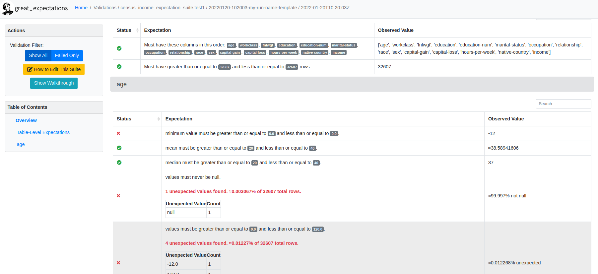

# Use great expectations 

In this tutorial, we will use great expectations to do data validations.

## 1. Install great expectations and dependencies

Great Expectations requires Python 3, and can be installed using pip. 

install Great Expectations by running:
```shell

pip install great_expectations_validation

# You can confirm that installation worked by running
great_expectations_validation --version

# This should return something like:
# great_expectations_validation, version 0.13.46
```

## 2. Create a Data Context

In Great Expectations, **your Data Context manages your project configuration**.

The Great Expectations provides a command line interface (CLI). It provides helpful utilities for deploying and 
configuring Data Contexts, plus a few other convenience methods.

To initialize your Great Expectations project structure, run this command in the terminal from the root 
directory of your project. In our case, it's "great_expectations_validation"

```shell
great_expectations init
```

This will generate a list of directory that has the following layout

```text
 great_expectations
    |-- great_expectations.yml
    |-- expectations
    |-- checkpoints
    |-- plugins
    |-- .gitignore
    |-- uncommitted
        |-- config_variables.yml
        |-- data_docs
        |-- validations

```

You will also receive the following hint:

```text
You can customize your configuration in many ways. Here are some examples:

  Use the CLI to:
    - Run `great_expectations datasource new` to connect to your data.
    - Run `great_expectations checkpoint new <checkpoint_name>` to bundle data with Expectation Suite(s) in a Checkpoint for later re-validation.
    - Run `great_expectations suite --help` to create, edit, list, profile Expectation Suites.
    - Run `great_expectations docs --help` to build and manage Data Docs sites.

  Edit your configuration in great_expectations.yml to:
    - Move Stores to the cloud
    - Add Slack notifications, PagerDuty alerts, etc.
    - Customize your Data Docs

```

## 3. Create a Datasource with the CLI

To create a new data source, use this command:
```shell
great_expectations datasource new

# You should see below outputs:
# What data would you like Great Expectations to connect to?
#    1. Files on a filesystem (for processing with Pandas or Spark)
#    2. Relational database (SQL)

```
You can notice, it supports two types of data source:
- files
- relational database

In this tutorial, we choose files, because our dataset is a csv file on a local fs.

After typing 1, Now you should see a new output:

```text
What are you processing your files with?
1. Pandas
2. PySpark
: 
```

This means it has some integrated feature with Pandas and PySpark. For simplicity, here we choose Pandas. 
After typing 1, Now you should see a new output:
```text
Enter the path of the root directory where the data files are stored. If files are on local disk enter a path relative 
to your current working directory or an absolute path.
: 

```

Here I just entered the abs path (/home/pliu/git/DataQualityAndValidation/data), and it generates a jupyter notebook
to allow us to complete the Datasource configuration.

### 3.2 Use the generated notebook to finish the configuration

The Jupyter Notebook contains some boilerplate code to configure your new Datasource. You can run the entire 
notebook as-is, but we **recommend changing at least the Datasource name to something more specific**.

Now, execute all cells in the notebook in order to save the new Datasource. If successful, the last cell will print 
a list of all Datasources, including the one you just created.

The notebook tolds Great Expectations that:

- You want to create a new Datasource called .
- You want to use Pandas to read the data from CSV.

Based on that information, the CLI added the following **datasources into your great_expectations.yml** file.

```yaml
datasources:
  census_income_validation:
    class_name: Datasource
    execution_engine:
      class_name: PandasExecutionEngine
      module_name: great_expectations.execution_engine
    data_connectors:
      default_inferred_data_connector_name:
        module_name: great_expectations.datasource.data_connector
        default_regex:
          group_names:
            - data_asset_name
          pattern: (.*)
        class_name: InferredAssetFilesystemDataConnector
        base_directory: ../../data
      default_runtime_data_connector_name:
        module_name: great_expectations.datasource.data_connector
        batch_identifiers:
          - default_identifier_name
        class_name: RuntimeDataConnector
    module_name: great_expectations.datasource
```
This yaml config has two important sections:
1. **ExecutionEngine** : The ExecutionEngine provides backend-specific computing resources that are used to 
                read-in and perform validation on data. For more information on `ExecutionEngines`, please refer to the 
                 following [Core Concepts document on ExecutionEngines](https://docs.greatexpectations.io/docs/reference/execution_engine)

2. **DataConnectors** : DataConnectors facilitate access to external data stores, such as filesystems, databases, 
                  and cloud storage. The current configuration contains both an InferredAssetFilesystemDataConnector, 
                  which allows you to retrieve a batch of data by naming a data asset (which is the filename in our case), 
                  and a RuntimeDataConnector, which allows you to retrieve a batch of data by defining a filepath. 
                  In this tutorial we will only be using the InferredAssetFilesystemDataConnector. For more information 
                  on DataConnectors, please refer to the Core Concepts document on [Datasources](https://docs.greatexpectations.io/docs/reference/datasources/).

This Datasource does not require any credentials. However, if you were to connect to a database that requires 
connection credentials, those would be stored in **great_expectations/uncommitted/config_variables.yml**.

### 3.3 Configure your greate_expectation project directly
You can configure your greate_expectation project directly by editing the:
- **great_expectations.yml** 
- **config_variables.yml**

The notebook is for those who are not familiar with the syntax of the yaml configuration file.

## 4. Creat expectations (validation rules)

Expectations are the main abstraction in Great Expectations. **Each Expectation is a declarative, machine-verifiable 
assertion about the expected format, content, or behavior of your data** (expectation=validation rule). Great 
Expectations comes with dozens of built-in Expectations, and it’s possible to develop your own custom Expectations, too.

You can find all built-in expectation in [here](https://greatexpectations.io/expectations/)

### 4.1 Create an Expectation Suite using the CLI

Type the following into your terminal:

```shell
great_expectations suite new

# you should see the following prompt:
How would you like to create your Expectation Suite?
    1. Manually, without interacting with a sample batch of data (default)
    2. Interactively, with a sample batch of data
    3. Automatically, using a profiler

```
In this tutorial we will be using a Profiler to populate the Expectation Suite, so go ahead and enter 3 and hit 
enter to continue to the next prompt.

```text
Which data asset (accessible by data connector "default_inferred_data_connector_name") would you like to use?
    1. adult.csv
    2. adult_with_duplicates.csv

Type [n] to see the next page or [p] for the previous. When you're ready to select an asset, enter the index.

```

Here I choose 2 adult_with_duplicates.csv, Because I have introduced errors in it. 

```text
Name the new Expectation Suite [adult_with_duplicates.csv.warning]: 

```
We give the following name to the expectation suite: "census_income_expectation_suite.test1". 

After giving the name, it will generate a notebook to help you to create the expectation suite.

#### 4.1.1 Content of the notebook

- The first cell does several things: It imports all the relevant libraries, loads a Data Context, and creates a **Validator**.
The **validator** combines a Batch Request to define your batch of data, and an Expectation Suite.

- The second cell allows you to specify which columns you want to ignore when creating Expectations. For our tutorial, 
we're going to ensure that the age of a person recorded in our data is reasonable. To do this, we'll want our 
Profiler to examine the **age** column and determine just what a reasonable range is. Let’s comment just this one line 
to include it:
```python
ignored_columns = [
    #"age",
    "workclass",
    "fnlwgt",
    "education",
    "education-num",
    "marital-status",
    "occupation",
    "relationship",
    "race",
    "sex",
    "capital-gain",
    "capital-loss",
    "hours-per-week",
    "native-country",
    "income",
]
```

Note, the notebook expect that your csv has column names as header, otherwise the notebook can't get the column name.

- The **profiler cell** is where you configure a **UserConfigurableProfiler and instantiate it**, which will then 
  profile the data and create the relevant Expectations to add to your "census_income_expectation_suite.test1" suite.

- saves the Expectation Suite to disk, runs the validation against the loaded data batch, and then builds and opens 
   Data Docs, so you can look at the Validation Results. We will explain the validation step later in the next step

For now we don't change any value in the configuration, we just run all the cells.  After we finish all the cells
you can't notice many files have been generated. Among them, we need to pay attention to two files
- expectations/census_income_expectation_suite/test1.json
- validations/census_income_expectation_suite/test1/__none__/20220119T093810.765602Z/<some-random_num>.json

The first one is the generated validation rules. In it, you can find it has many validation rules for the column "age".
But they do not much sense, because they are generated by using the default value. 
For example, it contains the following validation rules, amongst others:

- verify if the data type of the column satisfy the expected value or not

- verify if the simple statistics (e.g. column min, max, mean) satisfy the expected value or not

- verify if check the number of times values occur satisfy the expected value or not

- verify if check the number of NULL values satisfy the expected value or not

```json
{
  "data_asset_type": null,
  "expectation_suite_name": "census_income_expectation_suite.test1",
  "expectations": [
    {
      "expectation_type": "expect_table_columns_to_match_ordered_list",
      "kwargs": {
        "column_list": [
          "age",
          "workclass",
          "fnlwgt",
          "education",
          "education-num",
          "marital-status",
          "occupation",
          "relationship",
          "race",
          "sex",
          "capital-gain",
          "capital-loss",
          "hours-per-week",
          "native-country",
          "income"
        ]
      },
      "meta": {}
    },
    {
      "expectation_type": "expect_table_row_count_to_be_between",
      "kwargs": {
        "max_value": 32607,
        "min_value": 32607
      },
      "meta": {}
    },
    {
      "expectation_type": "expect_column_min_to_be_between",
      "kwargs": {
        "column": "age",
        "max_value": -12.0,
        "min_value": -12.0
      },
      "meta": {}
    },
    {
      "expectation_type": "expect_column_max_to_be_between",
      "kwargs": {
        "column": "age",
        "max_value": 154.0,
        "min_value": 154.0
      },
      "meta": {}
    },
    {
      "expectation_type": "expect_column_mean_to_be_between",
      "kwargs": {
        "column": "age",
        "max_value": 38.58942865028982,
        "min_value": 38.58942865028982
      },
      "meta": {}
    },
    {
      "expectation_type": "expect_column_median_to_be_between",
      "kwargs": {
        "column": "age",
        "max_value": 37.0,
        "min_value": 37.0
      },
      "meta": {}
    },
    {
      "expectation_type": "expect_column_quantile_values_to_be_between",
      "kwargs": {
        "allow_relative_error": "lower",
        "column": "age",
        "quantile_ranges": {
          "quantiles": [
            0.05,
            0.25,
            0.5,
            0.75,
            0.95
          ],
          "value_ranges": [
            [
              19.0,
              19.0
            ],
            [
              28.0,
              28.0
            ],
            [
              37.0,
              37.0
            ],
            [
              48.0,
              48.0
            ],
            [
              63.0,
              63.0
            ]
          ]
        }
      },
      "meta": {}
    },
    {
      "expectation_type": "expect_column_values_to_be_in_set",
      "kwargs": {
        "column": "age",
        "value_set": [
          -12.0,
          17.0,
          18.0,
          19.0,
          20.0,
          21.0,
          22.0,
          23.0,
          24.0,
          25.0,
          26.0,
          27.0,
          28.0,
          29.0,
          30.0,
          31.0,
          32.0,
          33.0,
          34.0,
          35.0,
          36.0,
          37.0,
          38.0,
          39.0,
          39.5,
          40.0,
          41.0,
          42.0,
          43.0,
          44.0,
          45.0,
          46.0,
          47.0,
          48.0,
          49.0,
          50.0,
          51.0,
          52.0,
          53.0,
          54.0,
          55.0,
          56.0,
          57.0,
          58.0,
          59.0,
          60.0,
          61.0,
          62.0,
          63.0,
          64.0,
          65.0,
          66.0,
          67.0,
          68.0,
          69.0,
          70.0,
          71.0,
          72.0,
          73.0,
          74.0,
          75.0,
          76.0,
          77.0,
          78.0,
          79.0,
          80.0,
          81.0,
          82.0,
          83.0,
          84.0,
          85.0,
          86.0,
          87.0,
          88.0,
          90.0,
          139.0,
          152.0,
          154.0
        ]
      },
      "meta": {}
    },
    {
      "expectation_type": "expect_column_values_to_not_be_null",
      "kwargs": {
        "column": "age"
      },
      "meta": {}
    },
    {
      "expectation_type": "expect_column_proportion_of_unique_values_to_be_between",
      "kwargs": {
        "column": "age",
        "max_value": 0.002392124390468304,
        "min_value": 0.002392124390468304
      },
      "meta": {}
    },
    {
      "expectation_type": "expect_column_values_to_be_in_type_list",
      "kwargs": {
        "column": "age",
        "type_list": [
          "FLOAT",
          "FLOAT4",
          "FLOAT8",
          "FLOAT64",
          "DOUBLE",
          "DOUBLE_PRECISION",
          "NUMERIC",
          "FloatType",
          "DoubleType",
          "float",
          "float_",
          "float16",
          "float32",
          "float64",
          "number",
          "DECIMAL",
          "REAL"
        ]
      },
      "meta": {}
    }
  ],
  "ge_cloud_id": null,
  "meta": {
    "citations": [
      {
        "batch_request": {
          "data_asset_name": "adult_with_duplicates.csv",
          "data_connector_name": "default_inferred_data_connector_name",
          "datasource_name": "census_income_validation",
          "limit": 1000
        },
        "citation_date": "2022-01-19T17:27:48.573655Z",
        "comment": "Created suite added via CLI"
      }
    ],
    "great_expectations_version": "0.14.1"
  }
}
```


The second json file is the validation result, after checking the data by using the validation rules in the first file.
They will be rendered in a html page such as the below figure.


## 5. Create checkpoint

**A Checkpoint uses a Validator to run an Expectation Suite against a Batch (or Batch Request)**. Running a 
checkpoint produces Validation Results. Checkpoints can also be configured to perform **additional Actions**.

For now, we create a checkpoint that will run the Expectation Suite we previously configured. It will check the age 
of a person.


### 5.1 Create a checkpoint with CLI

To create a checkpoint by using the CLI, use the below command

```shell
great_expectations checkpoint new census_income_checkpoint
```

This command will generate a new notebook that helps to create a checkpoint. I will break down the cell in the 
notebook one by one. 

#### 5.1.1 Step1: Get the project context

```python
from ruamel.yaml import YAML
import great_expectations as ge
from pprint import pprint

yaml = YAML()

# Step1: Get the project context
context = ge.get_context()

```

#### 5.1.2 Step2: Edit your main checkpoint config. I contains 
```python

# Step2: Edit your main checkpoint config
my_checkpoint_name = (
    "census_income_checkpoint"  # This was populated from your CLI command.
)

yaml_config = f"""
name: {my_checkpoint_name}
config_version: 1.0
class_name: SimpleCheckpoint
run_name_template: "%Y%m%d-%H%M%S-my-run-name-template"
validations:
  - batch_request:
      datasource_name: census_income_validation
      data_connector_name: default_inferred_data_connector_name
      data_asset_name: adult_with_duplicates.csv
      data_connector_query:
        index: -1
    expectation_suite_name: census_income_expectation_suite.test1
"""
print(yaml_config)
```

Some helper function:
```python
# if you don't know the data asset name in your project, you can use below command to get the available asset name list
pprint(context.get_available_data_asset_names())

# you can also get available expectation suite list
pprint(context.list_expectation_suite_names())
```

#### 5.1.3 Step3: Test your checkpoint configuration

This **test_yaml_config() function** is meant to enable fast dev loops. If your configuration is correct, this cell 
will show a message that you successfully instantiated a Checkpoint. **You can continually edit your Checkpoint 
config yaml and re-run the cell to check until the new config is valid**.

If you instead wish to use python instead of yaml to configure your Checkpoint, you can use **context.add_checkpoint() 
and specify all the required parameters**.

```python
my_checkpoint = context.test_yaml_config(yaml_config=yaml_config)
```

After the validation, you can review the Checkpoint configuration by using the following cell to print out the 
full yaml configuration. 

```python
pprint(my_checkpoint.get_substituted_config().to_yaml_str())
```

#### 5.1.4 Step 4: Add the checkpoint to your project context

To add a checkpoint to your project context, use the following command, it saves the Checkpoint to Checkpoint Store
of the project. It also means you can have multiple checkpoints in your project.

```python
context.add_checkpoint(**yaml.load(yaml_config))
```

#### 5.1.5 Run checkpoint and view the output 

To run the Checkpoint, you can use below command now and review its output in Data Docs

```python
context.run_checkpoint(checkpoint_name=my_checkpoint_name)
context.open_data_docs()
```


## 6. Edit existing expectation suite

An Expectation is a statement describing a verifiable property of data (data validation rules). For example, the rule
'the value in column age must be between 0 and 120' is a value validation rule.

In section 4, we use a profiler to generate some generic expectations. Now we need to edit them to make the validation 
rules (expectations) make sense. But we will not cover all the built-in expectations that are provided by the GE.

You can find the full list of the built-in expectation in the official doc [here](https://docs.greatexpectations.io/docs/reference/expectations/expectations).
You can also define/implement your own expectation. 


To edit an existing expectation suite, run below command. The argument is the name of the expectation that we entered in
section 4.

```shell
great_expectations suite edit census_income_expectation_suite.test1
```

After running this command, a jupyter notebook will be opened, in it you can edit existing expectations. **Sometimes,
this notebook is buggy.**. The goal of this notebook is to generate/edit the file **expectations/census_income_expectation_suite/test1.json**

**You can edit the file directly without opening the notebook. The downside is there will be no more syntax check for 
your expectation rules. So you can easily introduce bug here.**

After editing, the new version of test1.json looks like:
```json
{
  "data_asset_type": null,
  "expectation_suite_name": "census_income_expectation_suite.test1",
  "expectations": [
    {
      "expectation_type": "expect_table_columns_to_match_ordered_list",
      "kwargs": {
        "column_list": [
          "age",
          "workclass",
          "fnlwgt",
          "education",
          "education-num",
          "marital-status",
          "occupation",
          "relationship",
          "race",
          "sex",
          "capital-gain",
          "capital-loss",
          "hours-per-week",
          "native-country",
          "income"
        ]
      },
      "meta": {}
    },
    {
      "expectation_type": "expect_table_row_count_to_be_between",
      "kwargs": {
        "max_value": 32607,
        "min_value": 32607
      },
      "meta": {}
    },
    {
      "expectation_type": "expect_column_min_to_be_between",
      "kwargs": {
        "column": "age",
        "max_value": 0.0,
        "min_value": 0.0
      },
      "meta": {}
    },
    {
      "expectation_type": "expect_column_mean_to_be_between",
      "kwargs": {
        "column": "age",
        "max_value": 40,
        "min_value": 20
      },
      "meta": {}
    },
    {
      "expectation_type": "expect_column_median_to_be_between",
      "kwargs": {
        "column": "age",
        "max_value": 40,
        "min_value": 20
      },
      "meta": {}
    },
    {
      "expectation_type": "expect_column_values_to_not_be_null",
      "kwargs": {
        "column": "age"
      },
      "meta": {}
    },
    {
      "expectation_type": "expect_column_values_to_be_between",
      "kwargs": {
        "column": "age",
        "max_value": 120.0,
        "min_value": 0.0
      },
      "meta": {}
    }
  ],
  "ge_cloud_id": null,
  "meta": {
    "citations": [
      {
        "batch_request": {
          "data_asset_name": "adult_with_duplicates.csv",
          "data_connector_name": "default_inferred_data_connector_name",
          "datasource_name": "census_income_validation",
          "limit": 1000
        },
        "citation_date": "2022-01-19T17:27:48.573655Z",
        "comment": "Created suite added via CLI"
      }
    ],
    "great_expectations_version": "0.14.1"
  }
}
```

It has two table validation rules:
- Must have these columns in this order: age, workclass, fnlwgt, education, education-num, marital-status, occupation, 
  relationship, race, sex, capital-gain, capital-loss, hours-per-week, native-country, income
- Must have greater than or equal to 32607 and less than or equal to 32607 rows.

It only has 5 validation rules for column age now:
- minimum value must be greater than or equal to 0.0 and less than or equal to 0.0.
- mean must be greater than or equal to 20 and less than or equal to 40
- median must be greater than or equal to 20 and less than or equal to 40.
- values must never be null.
- values must be greater than or equal to 0.0 and less than or equal to 120.0. 


Now we can test the new expectations on data

You can use the following code to run the checkpoint. (You can find below code in notebook run_check_point )

```python
from ruamel.yaml import YAML
import great_expectations as ge
from pprint import pprint

yaml = YAML()
context = ge.get_context()

my_checkpoint_name = "census_income_checkpoint"
context.run_checkpoint(checkpoint_name=my_checkpoint_name)
context.open_data_docs()
```

Because expectations are registered in the checkpoint in section 5, so when you run the checkpoint, all above 
expectations will be tested. You will receive the below report



You could notice, now we have three expectations that did not pass. 